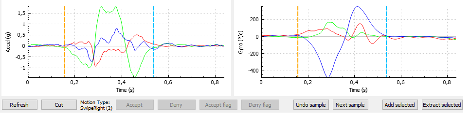
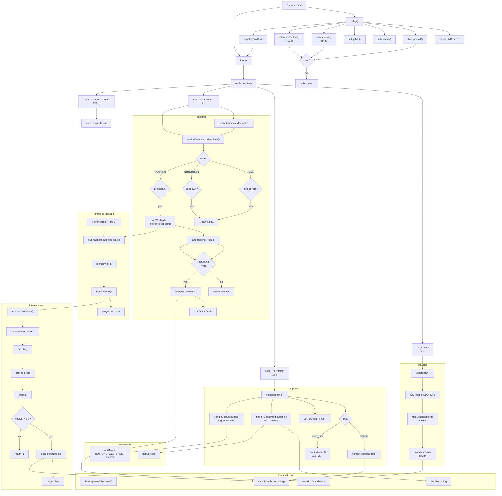

# esp32-motion-presenter

ESP32-based Bluetooth presentation remote with IMU gesture recognition and on-device TinyML inference.

The device uses an MPU-6050 inertial sensor to recognize hand gestures and convert them into presentation commands. The gesture recognition model runs directly on the ESP32 using TensorFlow Lite Micro.

The project currently targets dual-core ESP32 devices:

- ESP32-WROOM-32 — Xtensa LX6
- ESP32-S3 — Xtensa LX7

The current implementation was developed and tested primarily on the ESP32-WROOM-32.

# About the project

This is my student project focused on embedded systems and TinyML.

1. TinyML and machine learning for data classification on microcontrollers
2. Working with IMU sensors
3. Communication between embedded devices and computers
4. Running machine learning inference on resource-constrained devices

The project combines these areas into a wireless presentation remote with gesture recognition.

The device supports:
- Manual control using physical buttons
- Gesture-based presentation control
- Bluetooth HID
- BLE/GATT communication
- IMU data collection
- On-device neural network inference
- Debugging and inference result transmission

# Current status

The main data collection and processing pipeline has been implemented and tested.

The TinyML model is successfully running directly on the ESP32.

Current results:
- 8 gesture classes
- model on 11640 parametrs
- ~77-80 ms average inference time
- ~95% test-set accuracy
- Gesture recognition performed entirely on the microcontroller
- Inference is executed on the second CPU core

The current model recognizes:
```
 - CircleCCW
 - CircleCW
 - NormalHandMovement
 - SwipeDown
 - SwipeLeft
 - SwipeRight
 - SwipeUp
 - Unknown
```


# Gesture recognition pipeline

The complete machine learning pipeline consists of several stages:

```
IMU data -> collection data -> preparation data -> windows generation -> model training -> Quantization/Export to .h model 
-> include to ESP32 -> TinyML inderence -> Gesture voting ->  Bluetooth HID command
```
# Dataset generetion
## STEP 1 - Data collection

Movement data was collected using a prototype of the device. This dataset includes:
```
SwipeLeft: 85 gestures. Total samples: 7923
SwipeRight: 85 gestures. Total samples: 8174
SwipeUp: 85 gestures. Total samples: 7455
SwipeDown: 85 gestures. Total samples: 8807
CircleCW: 40 gestures. Total samples: 7696
CircleCCW: 40 gestures. Total samples: 7439
NormalHandMovement: 3 gestures. Total samples: 6686
Unknown: 2 gestures. Total samples: 7047
```

## STEP 2: Data preparation

The data was prepared using a custom C++ application: extraneous information was trimmed, and start- and end-of-movement flags were set.


This makes it possible to extract training windows while preserving the temporal structure of each gesture.
The data preparation tool is one of my projects available on GitHub.

## STEP 3: Data export

Current parameters:
- Sampling rate: 250 Hz (4 ms sample period)
- Window: 50 samples (200 ms motion)
- Base stride: 20 samples (80 ms)
- Random jitter: ±N samples around each window boundary
- Stop condition: >25% overlap with the end-of-motion flag

For each gesture, windows are extracted sequentially. The first window's 
position is randomized near the start-of-motion flag. Each subsequent 
window is placed with a new random offset from the previous window's end. 
Slicing stops when a window overlaps the end flag by more than 25% of 
its size. This randomized slicing mimics real-device conditions, where 
the window boundary relative to the gesture start is not fixed.

# Training model

The data is exported to the specified directory and sorted into folders associated with the movement class.
Using python scripts and PyTorch model is trained, quantized, and prepared in .h format.

The trained model is then:
1. trained on the generated dataset
2. evaluated
3. quantized
4. post-quantization verification
5. converted into a C/C++ header
6. included directly in the ESP32 firmware


# Model evaluation

The current model achieved approximately 95% accuracy on the test dataset after quantization.

|param            | precision| recall | f1-score |support|
|---                |   -    |   -    |    -   | -   |
|CircleCCW          | 0.9787 | 0.9583 | 0.9684 | 48  |
|CircleCW           | 0.9423 | 0.9800 | 0.9608 | 50  |
|NormalHandMovement | 0.8696 | 0.8000 | 0.8333 | 50  |
| SwipeDown         | 0.9245 | 0.9608 | 0.9423 | 51  |
| SwipeLeft         | 0.9773 | 0.9773 | 0.9773 | 44  |
| SwipeRight        | 1.0000 | 1.0000 | 1.0000 | 46  |
| SwipeUp           | 0.9750 | 0.9750 | 0.9750 | 40  |
| Unknown           | 0.9434 | 0.9615 | 0.9524 | 52  |
|accuracy           | -      | -      | 0.9501 | 381 |
|macro avg          | 0.9513 | 0.9516 | 0.9512 | 381 |
|weighted avg       | 0.9496 | 0.9501 | 0.9495 | 381 |

```
The scripts I use are located in the "/scripts" folder.
```

These results are based on the prepared test dataset and should not be interpreted as the real-world recognition rate of the final device.

When using the model on the device, accuracy decreases due to:
1. transitions between gestures (the window may contain too little information about the gesture)
2. This is due to the small dataset, which was trained on the gestures of only two people. In reality, gesture mechanics can vary drastically from person to person.
3. 

## STEP 5: Running the model in device

The weights file is moved to the project's code folder. If the model has been modified (e.g., the number of classes or layers), the parameters in `modelConfig.h` are updated. The code is then compiled (the project currently uses the Arduino IDE) and flashed onto the microcontroller.

In esp32 WROOM (Xtensa LX6 core):
```
Sketch uses 1285561 bytes (61%) of program storage space. Maximum is 2097152 bytes.
Global variables use 46028 bytes (14%) of dynamic memory, leaving 281652 bytes for local variables. Maximum is 327680 bytes.
```

Using partition scheme:
```
NO OTA ( 2MB APP / 2MB SPIFFS ) 
```

## STEP 6: Usage experience

While the device is operating, inference data is transmitted via the serial port.

Subjectively, the CW and CCW rotation classes and the right swipe are recognized most accurately (~90–95%). For other gestures, the model achieves an accuracy of 85%. Executing an HID command requires more than two consecutive inferences with a model confidence level exceeding 75%. Following this, the gesture's HID command is not re-sent for 600 ms.

For swipe gestures, the HID command is sent in 7–8 out of 10 attempts on average.

For rotation gestures, this occurs in about 9–10 out of 10 attempts.


For model on 11,640 parameters average inference time of about 77–80 ms.

## TODO

1. Work is underway to compile a dataset and develop training methods for a new model to improve gesture detection.
2. Enable dataset collection and device debugging via BLE/GATT.
3. Finish implementing functions for collecting various debugging information.

## Project code structure


